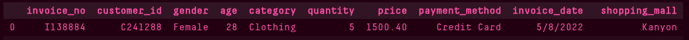
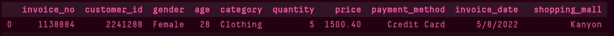
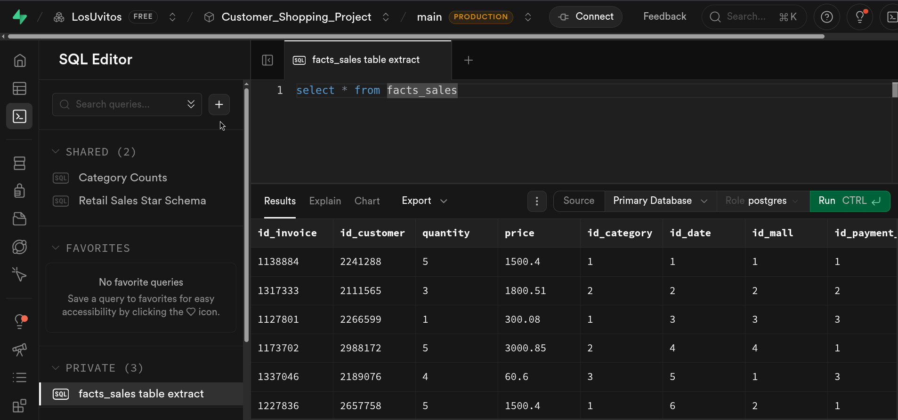
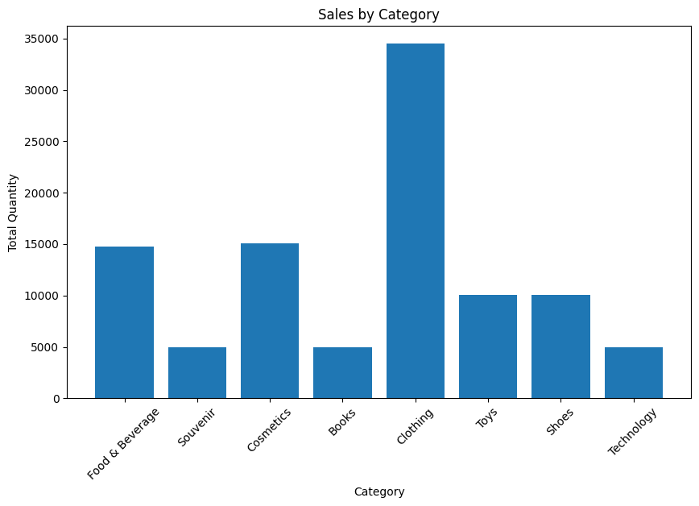
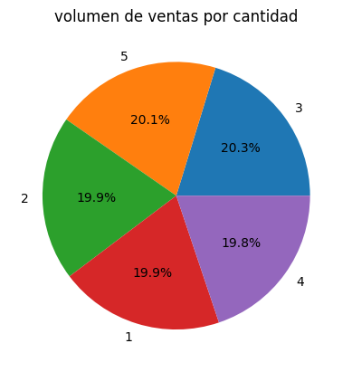
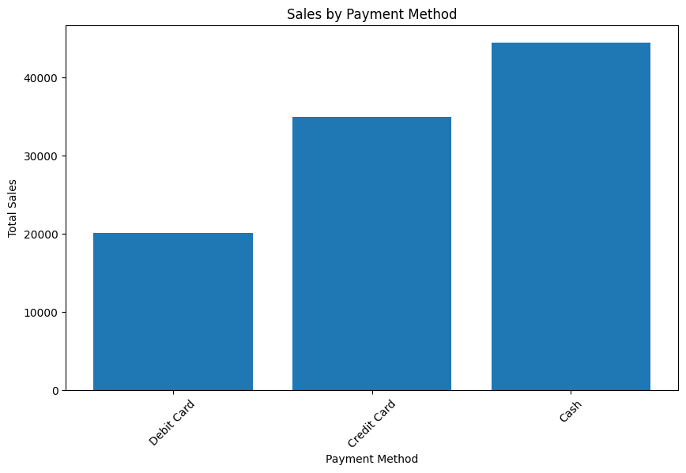
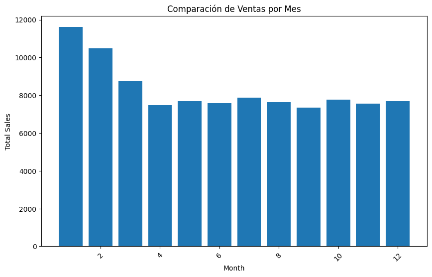

# Proyecto 1 — Bodega de Datos, ETL y Análisis Descriptivo
**Materia:** Introducción a la Ciencia de los Datos  
**Docente:** Héctor Fabio Ocampo Arbeláez  
**Dataset:** Customer Shopping Dataset — Retail Sales Analysis 
**Link:** https://www.kaggle.com/datasets/mehmettahiraslan/customer-shopping-dataset/data?select=customer_shopping_data.csv

**Fecha:** 09 - Marzo - 2026 

**Integrantes del Grupo:**
- Dilan Mauricio Lemos — 202359416
- Diego Fernando Lenis — 202359540
- Jaime Andrés Noreña  — 202359523
- Juan José Restrepo   — 202359517

---

## 1. Introducción

### 1.1 Objetivo del Proyecto

El presente proyecto tiene como objetivo aplicar los conocimientos adquiridos en bases de datos transaccionales y analíticas, bodegas de datos, procesos ETL y análisis descriptivo. A través del uso de herramientas como Python, Pandas, SQLAlchemy y PostgreSQL, se busca diseñar e implementar una bodega de datos funcional a partir de un dataset real de compras minoristas, que permita responder preguntas de negocio mediante consultas analíticas y visualizaciones de datos.

### 1.2 Descripción del Dataset

El dataset utilizado en este proyecto es el Customer Shopping Dataset, obtenido de la plataforma Kaggle. Contiene información detallada sobre transacciones de compra realizadas por clientes en distintos centros comerciales, incluyendo datos demográficos del comprador, características del producto adquirido, y condiciones de la transacción.

El dataset está compuesto por 10 atributos descritos a continuación:

| Columna | Descripción |
|---|---|
| `invoice_no` | Identificador único de cada factura de compra |
| `customer_id` | Identificador único del cliente que realizó la compra |
| `gender` | Género del cliente (Hombre / Mujer) |
| `age` | Edad del cliente |
| `category` | Categoría del producto adquirido |
| `quantity` | Cantidad de unidades compradas |
| `price` | Precio unitario del producto |
| `payment_method` | Método de pago utilizado (efectivo, tarjeta, etc.) |
| `invoice_date` | Fecha en que se realizó la transacción |
| `shopping_mall` | Centro comercial o tienda donde se efectuó la compra |

---

## 2. Diseño del Modelo de Bodega de Datos

### 2.1 Análisis del Dataset

El dataset presenta una estructura plana compuesta por datos categóricos simples y métricas cuantitativas directas. No existen relaciones jerárquicas profundas entre los atributos; (por ejemplo, el centro comercial no se descompone en ciudad, departamento o país). Los valores de columnas como `gender`, `category` y `payment_method` son repetitivos pero simples, limitados a un conjunto reducido de opciones fijas sin atributos propios adicionales.

### 2.2 Modelo Seleccionado: Modelo Estrella

El modelo seleccionado para el diseño de la bodega de datos es el **Modelo Estrella**. Esta decisión se fundamenta en las siguientes razones:

- **Estructura de datos simple y plana:** el dataset no presenta jerarquías naturales entre sus atributos que justifiquen la normalización útil propia del modelo Copo de Nieve.
- **Ausencia de jerarquías:** columnas como `shopping_mall`, `gender` o `payment_method` no poseen subatributos propios que requieran ser descompuestos en tablas adicionales.
- **Redundancia no problemática:** dado el volumen del dataset y la naturaleza de los datos categóricos, la redundancia al Modelo Estrella no representa un impacto significativo en rendimiento ni en integridad de los datos.
- **Simplicidad de consulta:** el Modelo Estrella permite realizar consultas analíticas con menos JOINs, lo que favorece la velocidad de respuesta y facilita el trabajo con herramientas de visualización.
- **Descarte justificado del Copo de Nieve:** el Modelo Copo de Nieve se descarta porque su ventaja principal —eliminar redundancia mediante normalización jerárquica— no aplica a este dataset al no existir dimensiones con ramificaciones reales.

### 2.3 Diagrama de la Bodega de Datos

---
#### Descripción Textual del Modelo

**Modelo seleccionado:** Estrella

El modelo está compuesto por una tabla de hechos central llamada `HECHOS_VENTAS` y cinco tablas de dimensiones que le dan contexto. Cada dimensión se conecta a la tabla de hechos mediante una clave foránea.

---

**FACT:SALES** *(Tabla de Hechos)*
- `id_invoice` — PK, identificador único de la transacción
- `id_customer` — FK → DIM_CLIENTE
- `id_category` — FK → DIM_CATEGORIA
- `id_date` — FK → DIM_DATE
- `id_mall` — FK → DIM_STORE
- `id_payment_method` — FK → DIM_PAYMENT
- `quantity` — cantidad de unidades compradas
- `unit_price` — precio unitario del producto
- `total_price` — valor total de la transacción (quantity × unit_price)

---

**DIM_CUSTOMER** *(Dimensión)*
- `id_customer` — PK
- `gender` — género del cliente
- `age` — edad del cliente

---

**DIM_CATEGORY** *(Dimensión)*
- `id_category` — PK
- `category` — nombre de la categoría del producto

---

**DIM_DATE** *(Dimensión)*
- `id_date` — PK
- `invoice_date` — fecha completa de la transacción
- `day` — día
- `month` — mes
- `year` — año

---

**DIM_STORE** *(Dimensión)*
- `id_mall` — PK
- `shopping_mall` — nombre del centro comercial

---

**DIM_PAYMENT** *(Dimensión)*
- `id_payment_method` — PK
- `payment_method` — método de pago utilizado

---

#### Diagrama Mermaid


#### Diagrama LucidChart


---
### 2.4 Script SQL — Creación de Tablas en PostgreSQL

---

## 3. Extracción, Transformación y Carga de Datos (ETL)

### 3.1 Descripción del Proceso ETL
El datatset se encuentra disponible en formato csv, para el primer paso(extracción) 
se importa este archivo como objeto de tipo dataframe usando la librería pandas, es 
necesario inspeccionar este datatset para poder describirlo correctamente, entender 
el tipo de datos que se almacena para saber qué representa y como podemos trabajar 
con esos datos.        
```python
csv_file = "customer_shopping_data.csv"
df = pd.read_csv(csv_file)
df.head()
df.info()
```                                                               
El datatset contiene 99.457 entradas con datos en 10 columnas, el siguiente paso es 
agrupar esas columnas según el modelo diseñado para la bodega de datos, este proceso 
es la transformación, para esto creamos tablas para pagos, tiendas, fecha de ventas,  
categorías y clientes, todas compartiendo al menos un atributo con la tabla de hechos.                                                                             
Una vez estás tablas han sido creadas el siguiente paso es cargarlas a una base de datos, 
para este proyecto se está usando una en la plataforma supabase.

### 3.2 Transformaciones Realizadas
- 1 - los ids de transaccion y cliente tienen una inicial, esta se reemplaza por un entero

```python
df['invoice_no'] = df['invoice_no'].replace("^I", "1", regex=True).astype(int)
df['customer_id'] = df['customer_id'].replace("^C", "2", regex=True).astype(int)
``` 
- 2 - Se convierte la fecha de compra en un tipo fecha
```python
df['invoice_date'] = pd.to_datetime(df['invoice_date'], format="%d/%m/%Y")
```
- 3 -Se cambia el nombre de las columnas de ID's para mejor claridad
```python
df.rename(columns={'customer_id': 'id_customer'}, inplace=True)
df.rename(columns={'invoice_no': 'id_invoice'},inplace=True)
```

    antes:

    
    despues:


- 4 - creacion de tablas del modelo

- customer/cliente

```python
dim_customer = df[["id_customer", "gender", "age"]].copy()
```

- category


```python
dim_category = df[["category"]].drop_duplicates().reset_index(drop=True)
dim_category["id_category"] = dim_category.index + 1
```
- date/fecha

```python
dim_date = df[["invoice_date"]].drop_duplicates().reset_index(drop=True)
dim_date["id_date"] = dim_date.index + 1
dim_date["day"] = dim_date["invoice_date"].dt.day
dim_date["month"] = dim_date["invoice_date"].dt.month
dim_date["year"] = dim_date["invoice_date"].dt.year

```
- store/tienda
```python
dim_store = df[["shopping_mall"]].drop_duplicates().reset_index(drop=True)
dim_store["id_mall"] = dim_store.index + 1
```

- payment

```python
dim_payment = df[["payment_method"]].drop_duplicates().reset_index(drop=True)
dim_payment["id_payment_method"] = dim_payment.index + 1
```

- tabla de hechos
```python

facts_sales = df.copy()
facts_sales = facts_sales.merge(dim_category, on='category', how='left')
facts_sales = facts_sales.merge(dim_date[['id_date', 'invoice_date']], on='invoice_date', how='left') 
facts_sales = facts_sales.merge(dim_store, on='shopping_mall', how='left') 
facts_sales = facts_sales.merge(dim_payment, on='payment_method', how='left') 
facts_sales = facts_sales.drop(columns=['category', 'payment_method', 'shopping_mall', 'invoice_date', 'gender', 'age'])


```


### 3.3 Evidencia de Carga en PostgreSQL

- codigo carga en db:
```python
dim_customer.to_sql("dim_customer", engine, if_exists="replace", index=False)
dim_category.to_sql("dim_category", engine, if_exists="replace", index=False)
dim_date.to_sql("dim_date", engine, if_exists="replace", index=False)
dim_store.to_sql("dim_store", engine, if_exists="replace", index=False)
dim_payment.to_sql("dim_payment", engine, if_exists="replace", index=False)
facts_sales.to_sql("facts_sales", engine, if_exists="replace", index=False)
```


se muestra la tabla de hechos cargada y mostrada mediante una query en el servicio supabase*
---

## 4. Consultas Analíticas en SQL

### 4.1 Total de ventas por categoría de producto
```sql
SELECT c.category, COUNT(*) AS total         
FROM facts_sales f                           
JOIN dim_category c                          
ON f.id_category = c.id_category             
GROUP BY category; 
```
### 4.2 Clientes con mayor volumen de compras
```sql
SELECT quantity, COUNT(*) AS total           
FROM facts_sales                             
GROUP BY quantity                            
ORDER BY total DESC;  
```

### 4.3 Métodos de pago más utilizados
```sql
SELECT p.payment_method, COUNT(*) AS total   
FROM facts_sales f                           
JOIN dim_payment p                           
ON f.id_payment_method = p.id_payment_method 
GROUP BY payment_method 
```

### 4.4 Comparación de ventas por mes
```sql
SELECT d.month, COUNT(*) as total            
FROM facts_sales f                           
JOIN dim_date d                              
ON f.id_date = d.id_date                     
GROUP BY month                               
ORDER BY month ASC
```

---

## 5. Análisis Descriptivo y Visualización de Datos

### 5.1 Visualizaciones
4.1 Total de ventas por categoría de producto


4.2 Clientes con mayor volumen de compras


4.3 Métodos de pago más utilizados


4.4 Comparación de ventas por mes


### 5.2 Tendencias e Insights

- Las ventas se disparan a inicio de año, normalizándose hasta estabilizarse durante todo el año con un
pequeño incremento gradual alrededor de junio y julio, la mayor diferencia entre el número de ventas se
da entre diciembre y enero

- el pago con tarjetas de débito es muy pequeño comparado al efectivo o crédito, indica que posiblemente
una persona preferirá comprar solo lo que puede costear, pero también prefiere recurrir una deuda para
adquirir productos

- los productos de mayor interés son ropa, comida y cosmética, dos elementos de necesidad

### 5.3 Propuestas de Mejora para el Negocio

- enfocar ofertas en precios a descuentos si el medio de pago es crédito, puesto que la mayoría de clientes prefiere comprar a crédito antes que abstenerse de compras que no pueden costear al momento esto podría aumentar las ventas si los precios parecieran más atractivos

- el número máximo de elementos por compra es de 5, diseñar ofertas de productos en base al volumen
(reducción de precios si se compra x cantidad) podría aumentar el volumen de ventas

- ofertas productos de las categorías menos vendidas en co junto con otras que se venden más para vaciar
stock viejo y potencialmente incrementar ventas

---

## 6. Conclusiones

- La información es un elemento fundamental en la gestión empresarial ya que el estudio detallado de los movimientos de los recursos de una empresa pueden servir para mejorar su desempeño o mitigar movimientos o potenciales pérdidas generados por la mala gestión de estos recursos.
- la ciencia de datos puede ayudar a hacer estos análisis al identificar asociaciones  e interacciones que resultan de la naturaleza del
mercado, puede ser especialmente útil entonces también para plantear estrategias de mejoramiento de negocios o proyectos en general.

---

## 7. Evaluación del Proyecto

| Fase | Ponderación |
|---|:---:|
| Diseño del modelo de bodega de datos | 20% |
| Implementación de ETL | 30% |
| Consultas Analíticas en SQL | 20% |
| Análisis Descriptivo y Visualización | 20% |
| Conclusiones y Presentación | 10% |
| **Total** | **100%** |

---

## 8. Anexos

### Anexo A — Código Python ETL
[codigo python](../src/df.ipynb)

### Anexo B — Scripts SQL Completos
[codigo sql](../src/database.sql)
[codigo sql](./querys.sql)

### Anexo C — Código Python Visualizaciones
[codigo graficas](../src/graf.ipynb)
