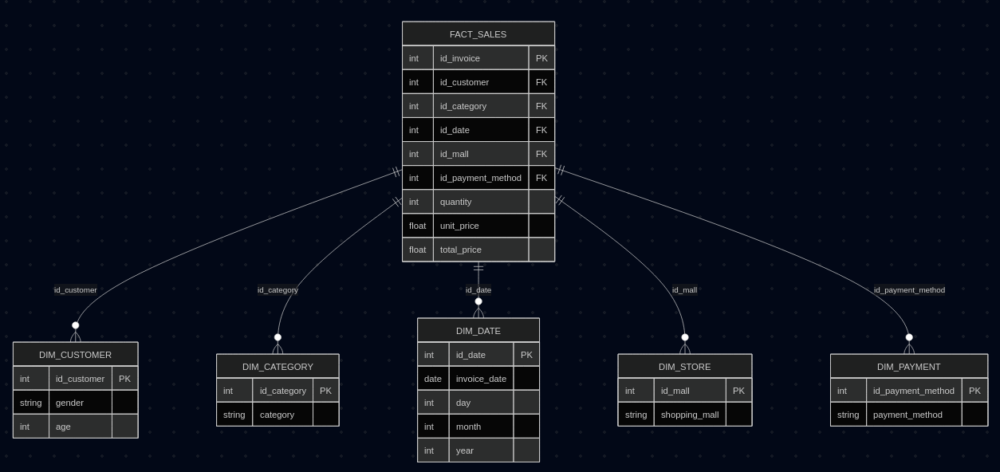
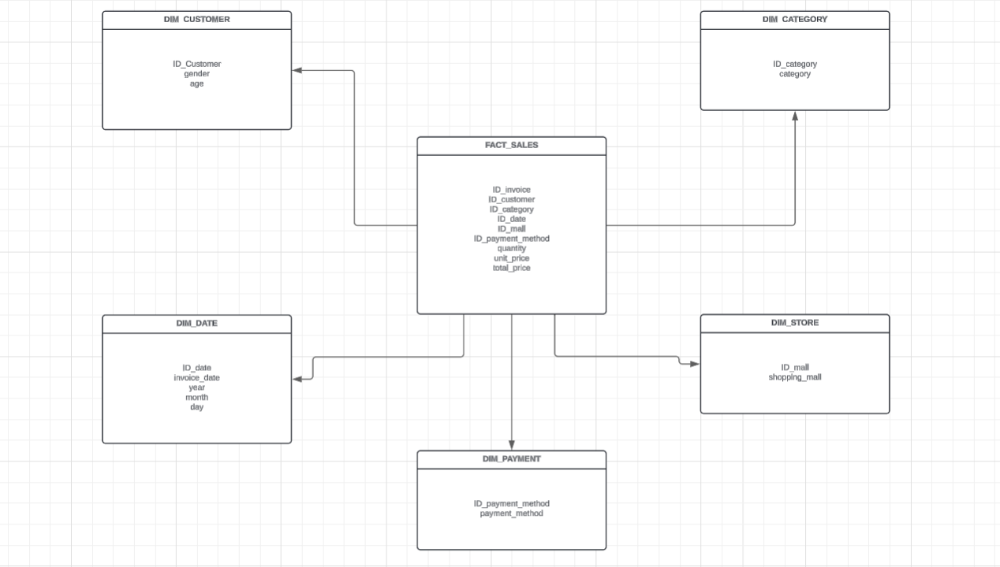

# Proyecto 1 — Bodega de Datos, ETL y Análisis Descriptivo
**Materia:** Introducción a la Ciencia de los Datos  
**Docente:** Héctor Fabio Ocampo Arbeláez  
**Dataset:** Customer Shopping Dataset — Retail Sales Analysis 
**Link:** https://www.kaggle.com/datasets/mehmettahiraslan/customer-shopping-dataset/data?select=customer_shopping_data.csv

**Fecha:** 09 - Marzo - 2026  

**Integrantes del Grupo:**
- Dilan Mauricio Lemos — 202359416
- Diego Fernando Lenis — 202359540
- Jaime Andrés Noreña  — 202359523
- Juan José Restrepo   — 202359517

---

## 1. Introducción

### 1.1 Objetivo del Proyecto

El presente proyecto tiene como objetivo aplicar los conocimientos adquiridos en bases de datos transaccionales y analíticas, bodegas de datos, procesos ETL y análisis descriptivo. A través del uso de herramientas como Python, Pandas, SQLAlchemy y PostgreSQL, se busca diseñar e implementar una bodega de datos funcional a partir de un dataset real de compras minoristas, que permita responder preguntas de negocio mediante consultas analíticas y visualizaciones de datos.

### 1.2 Descripción del Dataset

El dataset utilizado en este proyecto es el Customer Shopping Dataset, obtenido de la plataforma Kaggle. Contiene información detallada sobre transacciones de compra realizadas por clientes en distintos centros comerciales, incluyendo datos demográficos del comprador, características del producto adquirido, y condiciones de la transacción.

El dataset está compuesto por 10 atributos descritos a continuación:

| Columna | Descripción |
|---|---|
| `invoice_no` | Identificador único de cada factura de compra |
| `customer_id` | Identificador único del cliente que realizó la compra |
| `gender` | Género del cliente (Hombre / Mujer) |
| `age` | Edad del cliente |
| `category` | Categoría del producto adquirido |
| `quantity` | Cantidad de unidades compradas |
| `price` | Precio unitario del producto |
| `payment_method` | Método de pago utilizado (efectivo, tarjeta, etc.) |
| `invoice_date` | Fecha en que se realizó la transacción |
| `shopping_mall` | Centro comercial o tienda donde se efectuó la compra |

---

## 2. Diseño del Modelo de Bodega de Datos

### 2.1 Análisis del Dataset

El dataset presenta una estructura plana compuesta por datos categóricos simples y métricas cuantitativas directas. No existen relaciones jerárquicas profundas entre los atributos; (por ejemplo, el centro comercial no se descompone en ciudad, departamento o país). Los valores de columnas como `gender`, `category` y `payment_method` son repetitivos pero simples, limitados a un conjunto reducido de opciones fijas sin atributos propios adicionales.

### 2.2 Modelo Seleccionado: Modelo Estrella

El modelo seleccionado para el diseño de la bodega de datos es el **Modelo Estrella**. Esta decisión se fundamenta en las siguientes razones:

- **Estructura de datos simple y plana:** el dataset no presenta jerarquías naturales entre sus atributos que justifiquen la normalización útil propia del modelo Copo de Nieve.
- **Ausencia de jerarquías:** columnas como `shopping_mall`, `gender` o `payment_method` no poseen subatributos propios que requieran ser descompuestos en tablas adicionales.
- **Redundancia no problemática:** dado el volumen del dataset y la naturaleza de los datos categóricos, la redundancia al Modelo Estrella no representa un impacto significativo en rendimiento ni en integridad de los datos.
- **Simplicidad de consulta:** el Modelo Estrella permite realizar consultas analíticas con menos JOINs, lo que favorece la velocidad de respuesta y facilita el trabajo con herramientas de visualización.
- **Descarte justificado del Copo de Nieve:** el Modelo Copo de Nieve se descarta porque su ventaja principal —eliminar redundancia mediante normalización jerárquica— no aplica a este dataset al no existir dimensiones con ramificaciones reales.

### 2.3 Diagrama de la Bodega de Datos

Empecemos con los dos primeros. Primero déjame revisar el skill de diseño para el diagrama Mermaid.No hay un skill específico para Mermaid, así que lo construyo directamente. Aquí van los dos puntos:

---
#### Descripción Textual del Modelo

**Modelo seleccionado:** Estrella

El modelo está compuesto por una tabla de hechos central llamada `HECHOS_VENTAS` y cinco tablas de dimensiones que le dan contexto. Cada dimensión se conecta a la tabla de hechos mediante una clave foránea.

---

**FACT:SALES** *(Tabla de Hechos)*
- `id_invoice` — PK, identificador único de la transacción
- `id_customer` — FK → DIM_CLIENTE
- `id_category` — FK → DIM_CATEGORIA
- `id_date` — FK → DIM_DATE
- `id_mall` — FK → DIM_STORE
- `id_payment_method` — FK → DIM_PAYMENT
- `quantity` — cantidad de unidades compradas
- `unit_price` — precio unitario del producto
- `total_price` — valor total de la transacción (quantity × unit_price)

---

**DIM_CUSTOMER** *(Dimensión)*
- `id_customer` — PK
- `gender` — género del cliente
- `age` — edad del cliente

---

**DIM_CATEGORY** *(Dimensión)*
- `id_category` — PK
- `category` — nombre de la categoría del producto

---

**DIM_DATE** *(Dimensión)*
- `id_date` — PK
- `invoice_date` — fecha completa de la transacción
- `day` — día
- `month` — mes
- `year` — año

---

**DIM_STORE** *(Dimensión)*
- `id_mall` — PK
- `shopping_mall` — nombre del centro comercial

---

**DIM_PAYMENT** *(Dimensión)*
- `id_payment_method` — PK
- `payment_method` — método de pago utilizado

---

#### Diagrama Mermaid

#### Diagrama LucidChart

---
### 2.4 Script SQL — Creación de Tablas en PostgreSQL

---

## 3. Extracción, Transformación y Carga de Datos (ETL)

### 3.1 Descripción del Proceso ETL

### 3.2 Transformaciones Realizadas

### 3.3 Evidencia de Carga en PostgreSQL

---

## 4. Consultas Analíticas en SQL

### 4.1 Total de ventas por categoría de producto

### 4.2 Clientes con mayor volumen de compras

### 4.3 Métodos de pago más utilizados

### 4.4 Comparación de ventas por mes

---

## 5. Análisis Descriptivo y Visualización de Datos

### 5.1 Visualizaciones

### 5.2 Tendencias e Insights

### 5.3 Propuestas de Mejora para el Negocio

---

## 6. Conclusiones

---

## 7. Evaluación del Proyecto

| Fase | Ponderación |
|---|:---:|
| Diseño del modelo de bodega de datos | 20% |
| Implementación de ETL | 30% |
| Consultas Analíticas en SQL | 20% |
| Análisis Descriptivo y Visualización | 20% |
| Conclusiones y Presentación | 10% |
| **Total** | **100%** |

---

## 8. Anexos

### Anexo A — Código Python ETL

### Anexo B — Scripts SQL Completos

### Anexo C — Código Python Visualizaciones
